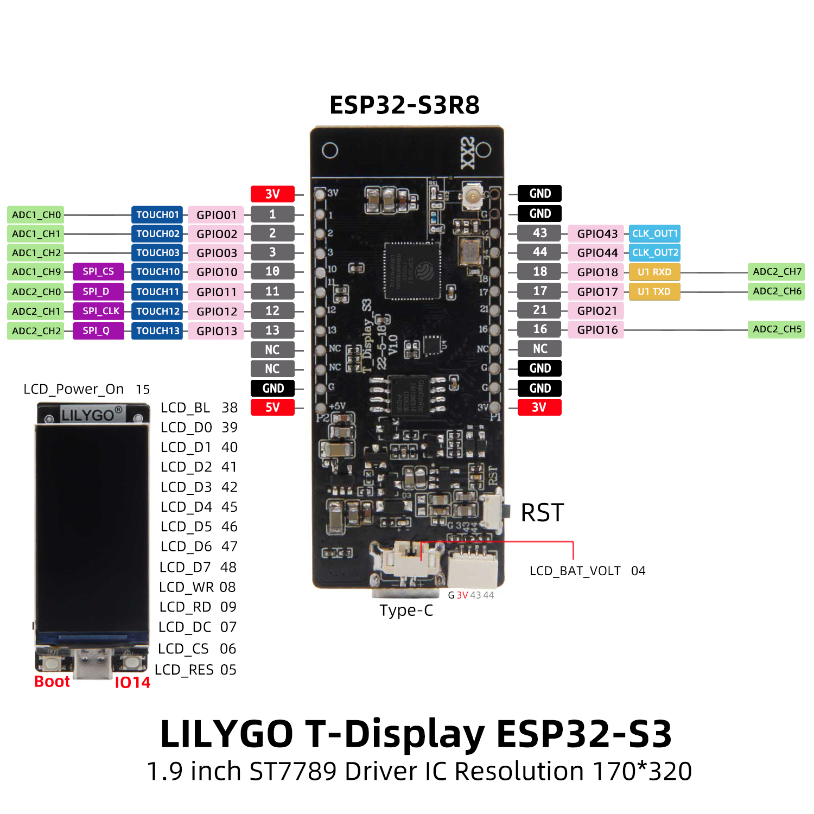

# T-Display-S3 Input/Output System (TIOS)

A input/output configuration system for the LilyGO T-Display-S3 featuring:
- **Interactive Pin Configuration**:
  - Set pins as digital (pull-up) inputs
  - ON/Off switches
  - Digital outputs
  - Analog inputs (with adjustable value smooting)
  - PWM outputs
  - Visual pin state indicators

- **Timer System**:
  - Two independent configurable timers (T1, T2)
  - Adjustable on/off intervals
  - Configurable multipliers
  - Analog pin control of timing values

- **Intuitive UI**:
  - Colour-coded pin types
  - Real-time state visualization
  - Contextual menu system
  - System information display (uptime, FPS, CPU frequency, supply voltage)

- **Power Management**:
  - Can be powered via USB or battery
  - Supply voltage monitoring
  - Display brightness control

## Hardware Configuration

| Function        | GPIO Pin |
|-----------------|----------|
| Left Button     | 0        |
| Right Button    | 14       |
| LCD Backlight   | 38       |
| LCD Power       | 15       |
| Battery Monitor | 4        |

## Pin Mapping

The system supports configuration of these physical pins:
- Left Side:
  - 1, 2, 3, 10, 11, 12, 13
- Right Side:
  - 43, 44, 18, 17, 21, 16

## Operation

- Press both buttons together to enter the main menu screen
- Use left (BOOT) button to navigate menu items
- Use right (KEY) button to select menu options

## Notes

- First build the project in PlatformIO to download the various libraries.
- In the ~.pio\libdeps\lilygo-t-display-s3\TFT_eSPI\User_Setup_Select.h file, make sure to:
  - **comment out** line 27 (#include <User_Setup.h>) and,
  - **uncomment** line 133 (#include <User_Setups/Setup206_LilyGo_T_Display_S3.h>)
- Only once the User_Setup_Select.h has been modified should the code be uploaded to the T-Display-S3.

## Credits

This project is inspired by [Volos Projects - TIOS](https://github.com/VolosR/tios)
